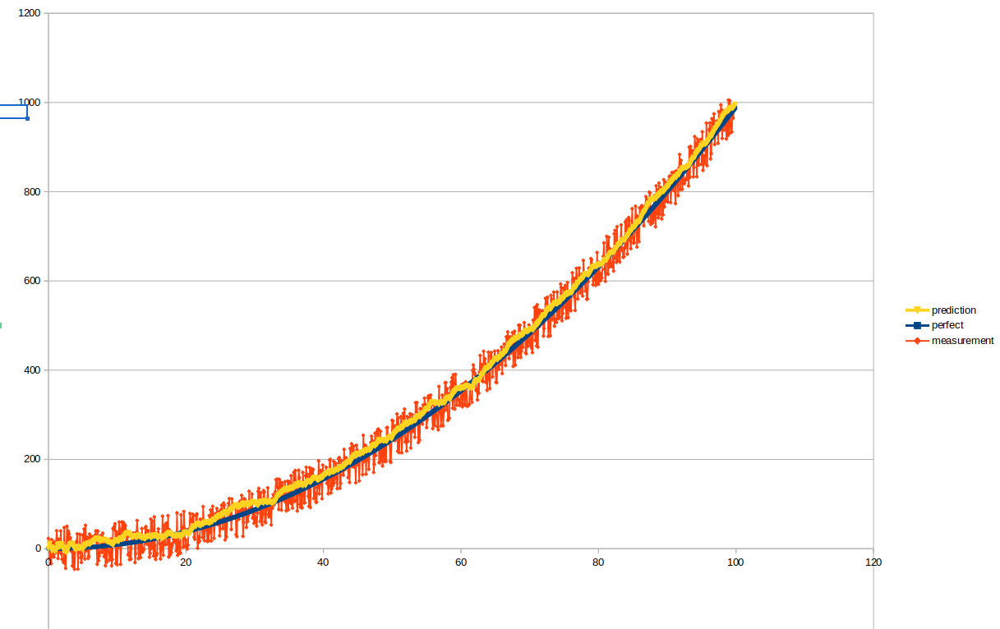

# Implementation of Discrete Kalman filter for object tracking purposes

The Kalman filter estimates the state of a system at time $k$ via the linear stochastic difference equation considering the state of a system at time $k$ is evolved from the previous state at time $k-1$. See the ref. https://en.wikipedia.org/wiki/Kalman_filter

In other words, the purpose of Kalman filter is to predict the next state via using prior knowledge of the current state. 

In this repository Hybrid Kalman filter is implemented considering continuous-time model while discrete-time measurements. See the ref. - https://en.wikipedia.org/wiki/Kalman_filter#Hybrid_Kalman_filter

## Main algorithm and equations

Define mentioned _linear stochastic difference equation_:

$$\chi_{k} = A⋅\chi_{k-1} + B⋅u_{k-1} + w_{k-1} \tag{1}$$

Define measurement model:
$$z_{k} = H⋅\chi_{k} + v_{k}\tag{2}$$

Let's denote variables:

* $A$ (sometimes it's written as $F$, but I prefer to stick with $A$) - [Transition matrix](https://en.wikipedia.org/wiki/State-transition_matrix) of size $n \times n$ relating state $k-1$ to state $k$
* $B$ - Control input matrix of size $n \times l$ which is applied to *optional* control input $u_{k-1}$
* $H$ - Transformation (observation) matrix of size $m \times n$.
* $u_{k}$ - Control input
* $w_{k}$ - Process noise vector with covariance $Q$. Gaussian noise with the normal probability distribution:
$$w(t) \sim N(0, Q) \tag{3}$$
* $v_{k}$ - Measurement noise vector (uncertainty) with covariance $R$. Gaussian noise with the normal probability distribution:
$$v(t) \sim N(0, R) \tag{4}$$

### Prediction

Let's use the dash sign " $-$ " as superscript to indicate the a priory state.

A priory state in matrix notation is defined as

$$\hat{\chi}^-_{k} = A⋅\hat{\chi}_{k-1} + B⋅u_{k-1} \tag{5}$$

$$\text{, where $\hat{\chi}^-_{k}$ - a priory state (a.k.a. predicted),  $\hat{\chi}_{k-1}$ - a posteriory state (a.k.a. previous)} $$

__Note: A posteriory state $\hat{\chi}_{k-1}$ on 0-th time step (initial) should be *guessed*__

Error covariance matrix $P^-$ is defined as

$$P^-_{k} =  A⋅P_{k-1}⋅A^{T} + Q \tag{6}$$

$$\text{, where $P_{k-1}$ - previously estimated error covariance matrix of size $n \times n$ (should match transition matrix dimensions), Q - process noise covariance}$$

__Note:__ $P_{k-1}$ __on 0-th time step (initial) should be *guessed*__

### Correction

The Kalman gain (which minimizes the estimate variance) in matrix notation is defined as:

$$K_{k} = P^-_{k}⋅H^{T}⋅(H⋅P^-_{k}⋅H^{T}+R)^{-1} \tag{7}$$

$$\text{, where H - transformation matrix, R - measurement noise covariance}$$

After evaluating the Kalman gain we need to update a priory state $\hat{\chi}^-_{k}$. In order to do that we need to calculate measurement residual:

$$r_{k} = z_{k} - H⋅\hat{\chi}^-_{k} \tag{8}$$

$$\text{, where $z_{k}$ - true measurement, $H⋅\hat{\chi}^-_{k}$ - previously estimated measurement}$$

Then we can update predicted state $\hat{\chi}_{k}$:

$$\hat{\chi}_{k} = \hat{\chi}^-_{k} + K_{k}⋅r_{k}$$

$$\text{or} \tag{9}$$

$$\hat{\chi}_{k} = \hat{\chi}^-_{k} + K_{k}⋅(z_{k} - H⋅\hat{\chi}^-_{k})$$

After that we should update error covariance matrix $P_{k}$ which will be used in next time stap (an so on):
$$P_{k} = (I - K_{k}⋅H)⋅P^-_{k}\tag{10}$$
$$\text{, where $I$ - identity matrix (square matrix with ones on the main diagonal and zeros elsewhere)}$$


### Overall
The whole algorithm can be described as high-level diagram:
<p align="center">

<p align="center">Fig 1. Operation of the Kalman filter. Welch & Bishop, 'An Introduction to the Kalman Filter'</p>
</p>

## 1-D Kalman filter

Considering acceleration motion let's write down its equations:

Velocity:
$$v = v_{0} + at \tag{11}$$
$$v(t) = x'(t) $$
$$a(t) = v'(t) = x''(t)$$

Position:
$$x = x_{0} + v_{0}t + \frac{at^2}{2} \tag{12}$$

Let's write $(11)$ and $(12)$ in Lagrange form:

$$x'_{k} = x'_{k-1} + x''_{k-1}\Delta t \tag{13}$$

$$x_{k} = x_{k-1} + x'_{k-1}\Delta t + \frac{x''_{k-1}(\Delta t^2)}{2} \tag{14}$$

State vector $\chi_{k}$ looks like:

$$\chi_{k} = \begin{bmatrix}
x_{k} \\
x'_{k}
\end{bmatrix} = \begin{bmatrix}
x_{k-1} + x'_{k-1}\Delta t + \frac{x''_{k-1}(\Delta t^2)}{2} \\
x'_{k-1} + x''_{k-1}\Delta t
\end{bmatrix} \tag{15}$$

Matrix form of $\chi_{k}$:

$$\chi_{k} = \begin{bmatrix} x_{k} \\
x'_{k} \end{bmatrix} = \begin{bmatrix} 1 & \Delta t \\
0 & 1\end{bmatrix} ⋅ \begin{bmatrix} x_{k-1} \\
x'_{k-1} \end{bmatrix} + \begin{bmatrix} \frac{\Delta t^2}{2} \\
\Delta t \end{bmatrix} ⋅ x''_{k-1} = \begin{bmatrix} 1 & \Delta t \\
0 & 1\end{bmatrix} ⋅ \chi_{k-1} + \begin{bmatrix} \frac{\Delta t^2}{2} \\
\Delta t \end{bmatrix} ⋅ x''_{k-1} \tag{16}$$


Taking close look on $(16)$ and $(1)$ we can write transition matrix $A$ and control input matrix $B$ as follows:

$$A = \begin{bmatrix} 1 & \Delta t \\
0 & 1\end{bmatrix} \tag{17}$$

$$B = \begin{bmatrix} \frac{\Delta t^2}{2} \\
\Delta t \end{bmatrix} \tag{18}$$

Let's find transformation matrix $H$. According to $(2)$:

$$z_{k} = H⋅\chi_{k} + v_{k} = \begin{bmatrix} 1 & 0 \end{bmatrix} ⋅\begin{bmatrix} x_{k} \\
{x'_{k}} \end{bmatrix} + v_{k} \tag{19}$$

$$ H = \begin{bmatrix} 1 & 0 \end{bmatrix} \tag{20}$$

__Notice:__ $v_{k}$ __in__ $(19)$ __- is not speed, but measurement noise! Don't be confused with notation. E.g.:__ 

$$ \text{$ \chi_{k} = \begin{bmatrix} 375.74 \\
0 - \text{assume zero velocity}  \end{bmatrix} $, $ v_{k} = 2.64 => $} $$

$$ \text{$ => z_{k} = \begin{bmatrix} 1 & 0 \end{bmatrix} ⋅\begin{bmatrix} 375.74 \\
0 \end{bmatrix} + 2.64 = \begin{bmatrix} 378.38 & 2.64 \end{bmatrix} $ - you can see that first vector argument it is just noise $v_{k}$ added to observation $x_{k}$}$$

$$ \text{and the second argument is noise $v_{k}$ itself.}$$

Process noise covariance matrix $Q$:

$$ Q = \begin{bmatrix} \sigma^2_{x} & \sigma_{x} \sigma_{x'} \\
\sigma_{x'} \sigma_{x} & \sigma^2_{x'}\end{bmatrix} \tag{21}$$

$$\text{, where} $$

$$ \text{$\sigma_{x}$ - standart deviation of position} $$

$$ \text{$\sigma_{x'}$ - standart deviation of velocity} $$

Since we know about $(14)$ we can define $\sigma_{x}$ and $\sigma_{x'}$ as:

$$ \sigma_{x} = \sigma_{x''} \frac{\Delta t^2}{2} \tag{22}$$

$$ \sigma_{x'} = \sigma_{x''} \Delta t \tag{23}$$

$$\text{, where $\sigma_{x''}$ - standart deviation of acceleration (tuned value)} $$

And now process noise covariance matrix $Q$ could be defined as:

$$ Q = \begin{bmatrix} (\sigma_{x''} \frac{\Delta t^2}{2})^2 & \sigma_{x''} \frac{\Delta t^2}{2} \sigma_{x''} \Delta t  \\
\sigma_{x''} \Delta t \sigma_{x''} \frac{\Delta t^2}{2} & (\sigma_{x''} \Delta t)^2 \end{bmatrix} = $$

$$ = \begin{bmatrix} (\sigma_{x''} \frac{\Delta t^2}{2})^2 & (\sigma_{x''})^2 \frac{\Delta t^2}{2} \Delta t  \\
(\sigma_{x''})^2 \Delta t \frac{\Delta t^2}{2} & (\sigma_{x''} \Delta t)^2 \end{bmatrix} = \begin{bmatrix} (\frac{\Delta t^2}{2})^2 & \frac{\Delta t^2}{2} \Delta t  \\
\Delta t \frac{\Delta t^2}{2} & \Delta t^2 \end{bmatrix} \sigma^2_{x''}$$

$$ = \begin{bmatrix} \frac{\Delta t^4}{4} & \frac{\Delta t^3}{2} \\
\frac{\Delta t^3}{2} & \Delta t^2 \end{bmatrix} \sigma^2_{x''} \tag{24}$$

Covariance of measurement noise $R$ is scalar (matrix of size $1 \times 1$) and it is defined as variance of the measurement noise:

$$ R = \sigma^2_{z}\tag{25}$$

Rust implementation is [here](./src/kalman/kalman_1d.rs#L4)

Example of usage:
```rust
    let dt = 0.1;
    let u = 2.0;
    let std_dev_a = 0.25;
    let std_dev_m = 1.2;

    let t: nalgebra::SVector::<f32, 1000> = nalgebra::SVector::<f32, 1000>::from_iterator(float_loop(0.0, 100.0, dt));
    let track = t.map(|t| dt*(t*t - t));


    let mut kalman = Kalman1D::new(dt, u, std_dev_a, std_dev_m);
    let mut measurement: Vec<f32> = vec![];
    let mut predictions: Vec<f32>= vec![];
    for (t, x) in t.iter().zip(track.iter()) {
        // Add some noise to perfect track
        let v: f32 = StdRng::from_entropy().sample::<f32, Standard>(Standard) * (50.0+50.0) - 50.0; // Generate noise in [-50, 50)
        let z = kalman.H.x * x + v;
        measurement.push(z);

        // Predict stage
        kalman.predict();
        predictions.push(kalman.x.x);

        // Update stage
        kalman.update(z).unwrap();
    }
    println!("time;perfect;measurement;prediction");
    for i in 0..track.len() {
        println!("{};{};{};{}", t[i], track[i], measurement[i], predictions[i]);
    }
```

How exported chart does look like:



## 2-D Kalman filter
@todo: physical model / text / code / plots

# Refrences
* [Greg Welch and Gary Bishop, ‘An Introduction to the Kalman Filter’, July 24, 2006](https://www.cs.unc.edu/~welch/media/pdf/kalman_intro.pdf)
* [Introducion to the Kalman Filter by Alex Becker](https://www.kalmanfilter.net/default.aspx)
* [Kalman filter on wikipedia](https://en.wikipedia.org/wiki/Kalman_filter)
* [State-transition matrix](https://en.wikipedia.org/wiki/State-transition_matrix)
* [Python implementation by Rahmad Sadli](https://machinelearningspace.com/object-tracking-python/)

# P.S.
I did struggle on displaying matrices in GitHub's MathJax markdown. If you know better way to do it you are welcome
